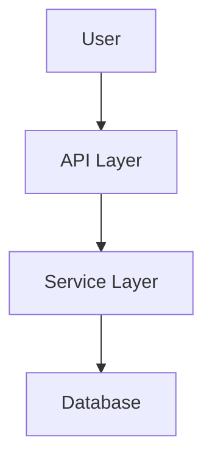

# Documentation Generation Workflow

Generate and maintain project documentation files for each feature/spec.

## Documentation Files

Each spec should have these documentation files in `product/specs/[spec-name]/`:

1. **QUICKSTART.md** - Get started quickly with the feature
2. **CHECKLIST.md** - Pre-deployment verification checklist
3. **ARCHITECTURE.md** - Technical design and architecture decisions

## When to Use

- **Initial creation**: Prefer `user-facing-docs` for current skill-first delivery. This workflow is a legacy template source for spec-local docs.
- **Updates**: Throughout development as architecture and requirements evolve


Do not use to create feature guides, runbooks, quickstarts, references, or onboarding docs directly — use `user-facing-docs`. Do not use to update product narrative docs (`product/product-overview.md`, `product/roadmap.md`) — use `docs-sync --scope product` for those. Do not use for syncing counts and version strings — use `docs-sync`.
## File Templates

### QUICKSTART.md

```markdown
# Quick Start: [Feature Name]

Get up and running with [Feature Name] in 5 minutes.

## Prerequisites

- [Requirement 1]
- [Requirement 2]
- [Requirement 3]

## Installation

[Step-by-step installation instructions]

```bash
# Example commands
npm install
npm run setup
```

## Basic Usage

[Simple example showing the primary use case]

```javascript
// Example code
const result = await feature.doSomething();
```

## Common Tasks

### [Task 1]

[Instructions]

### [Task 2]

[Instructions]

## Troubleshooting

| Problem | Solution |
|---------|----------|
| [Issue] | [Fix] |
| [Issue] | [Fix] |

## Next Steps

- [Link to ARCHITECTURE.md for technical details]
- [Link to main documentation]
- [Link to related features]
```

### CHECKLIST.md

```markdown
# Deployment Checklist: [Feature Name]

Use this checklist before deploying [Feature Name] to production.

## Development

- [ ] All tasks completed
- [ ] Code follows project standards
- [ ] No console.log or debugging code
- [ ] Error handling implemented
- [ ] Edge cases covered

## Testing

- [ ] Unit tests pass
- [ ] Integration tests pass
- [ ] Manual testing completed
- [ ] Edge cases tested
- [ ] Error scenarios tested

## Security

- [ ] Red-team review completed
- [ ] No hardcoded secrets/credentials
- [ ] Input validation in place
- [ ] Authentication/authorization verified
- [ ] OWASP Top 10 vulnerabilities checked

## Performance

- [ ] Load testing completed (if applicable)
- [ ] No memory leaks
- [ ] Response times acceptable
- [ ] Database queries optimized

## Documentation

- [ ] QUICKSTART.md is current
- [ ] ARCHITECTURE.md is current
- [ ] API documentation updated (if applicable)
- [ ] Comments added for complex logic

## Deployment

- [ ] Environment variables configured
- [ ] Database migrations ready
- [ ] Feature flags configured (if applicable)
- [ ] Rollback plan documented
- [ ] Monitoring/alerting configured

## Post-Deployment

- [ ] Smoke tests pass
- [ ] Error rates monitored
- [ ] Performance metrics checked
- [ ] User feedback collected

---

**Last Updated:** [Date]
**Feature Branch:** `feature/[spec-name]`
```

### ARCHITECTURE.md

```markdown
# Architecture: [Feature Name]

Technical design and architecture decisions for [Feature Name].

## Overview

[Brief description of what this feature does and how it fits into the system]

## System Context



## Components

| Component | Responsibility | Tech Stack |
|-----------|----------------|------------|
| [Component 1] | [What it does] | [Technology] |
| [Component 2] | [What it does] | [Technology] |

## Data Model

### [Entity 1]

```typescript
// Type definition or schema
interface Entity1 {
  id: string;
  // ...
}
```

### Relationships

- [Entity 1] → [Entity 2]: [relationship type]

## API Contracts

### [Endpoint 1]

**Method:** `POST` /api/resource

**Request:**
```json
{
  "field": "value"
}
```

**Response:**
```json
{
  "result": "value"
}
```

## Architecture Decisions (ADRs)

### [ADR-001] [Decision Title]

**Status:** Accepted | Proposed | Deprecated | Superseded

**Context:**
[What is the problem we're trying to solve?]

**Decision:**
[What did we decide?]

**Consequences:**
[What are the results of this decision?]

## Security Considerations

- [Authentication approach]
- [Authorization model]
- [Data encryption]
- [Input validation]
- [Rate limiting]

## Performance Considerations

- [Caching strategy]
- [Database optimization]
- [Async processing]
- [Scalability concerns]

## Error Handling

| Error Type | Handling | User Message |
|------------|----------|--------------|
| [Error 1] | [How handled] | [What user sees] |
| [Error 2] | [How handled] | [What user sees] |

## Testing Strategy

- **Unit Tests:** [What's covered]
- **Integration Tests:** [What's covered]
- **E2E Tests:** [What's covered]

## Future Considerations

- [Potential improvements]
- [Scalability concerns]
- [Technical debt to address]
```

## Generation Process

### 1. Initial Creation (When Starting Feature)

1. Read the spec.md for the feature
2. Create each file with the template above
3. Populate with spec-specific information:
   - Use feature name from spec
   - Fill in prerequisites from requirements
   - List components being built
   - Note any architecture decisions

### 2. Updates During Development

Update documentation when:

**QUICKSTART.md:**
- New features are added
- Usage patterns change
- New common tasks are identified
- New troubleshooting issues discovered

**CHECKLIST.md:**
- New verification steps are needed
- Security considerations emerge
- Testing requirements change

**ARCHITECTURE.md:**
- New components are added
- Data models change
- API contracts evolve
- Architecture decisions are made
- Security/performance considerations identified

### 3. Final Review (Before Merge)

During verification phase:
1. Review all three docs for completeness
2. Update with any final changes
3. Remove any outdated information
4. Ensure consistency with implemented code

## File Locations

```
product/specs/[spec-name]/
├── QUICKSTART.md
├── CHECKLIST.md
├── ARCHITECTURE.md
├── spec.md
├── requirements.md
└── tasks.md
```

## Notes

- These docs live alongside the spec, not in the main codebase
- They are specific to each feature/branch
- Update them as you learn more during development
- They become the historical record of why decisions were made

## Display

Documentation generation summary:

```
Docs generated:
  ✓ [doc-name] → docs/[path]
  ✓ [doc-name] → docs/[path]
Refresh with: docs-sync
```
